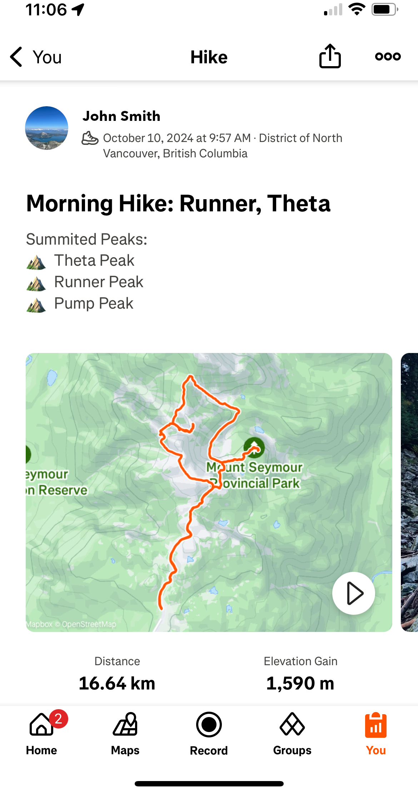
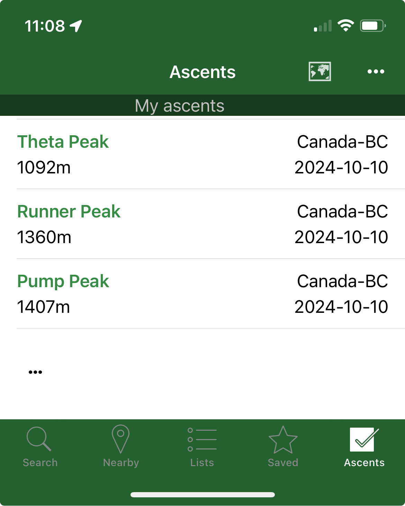
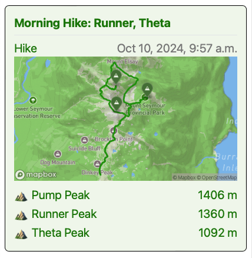

# Peak Logger

A basic web app that auto-detects summited peaks on Strava activities and optionally logs them to [peakbagger.com](https://peakbagger.com).

## How it Works

PeakLogger will automatically annotate summited peaks in the Strava activity description when you log a new activity.
 

Peakbagger can automatically log ascents to your Peakbagger.com account.
 

Peakbagger provides a convenient dashboard for viewing and analyzing your activities, and the peaks bagged on each recorded activity.
 

A deployed version of the app can be found here:
https://peaklogger.app

## Technology

This web app is built using Astro and is deployed on AWS.

